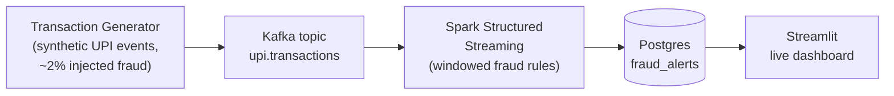

# UPI Fraud Detection

A real-time fraud detection pipeline for UPI (Unified Payments Interface) transactions. The goal is to flag anomalous transactions as they happen and surface them on a live dashboard, using a streaming architecture similar to what's used in production payment-fraud systems.

## Tech Stack

- **Python** — transaction generator, glue code
- **Kafka** — transaction event stream (`upi.transactions` topic)
- **Spark Structured Streaming** — windowed fraud-detection rules over the stream
- **PostgreSQL** — stores fraud alerts (`fraud_alerts` table)
- **Streamlit** — live dashboard for monitoring alerts
- **Docker** — containerized local deployment

## Architecture

**Flow:**
1. A synthetic transaction generator publishes UPI events to Kafka, with ~2% of transactions seeded as fraudulent.
2. Spark Structured Streaming consumes the topic and applies windowed fraud-detection rules (e.g. velocity checks, unusual amount/location patterns).
3. Flagged transactions are written to a `fraud_alerts` table in Postgres.
4. A Streamlit dashboard queries Postgres and displays alerts live.

## Status

This project is in early development. Current focus:

- [ ] Transaction generator (synthetic UPI events)
- [ ] Kafka topic setup
- [ ] Spark Structured Streaming fraud-rule job
- [ ] Postgres schema for alerts
- [ ] Streamlit live dashboard
- [ ] Docker Compose for one-command local setup

## Why This Project

Built to demonstrate an end-to-end streaming data pipeline — event generation, stream processing with windowed rules, persistence, and live visualization — applied to a realistic fraud-detection use case.
