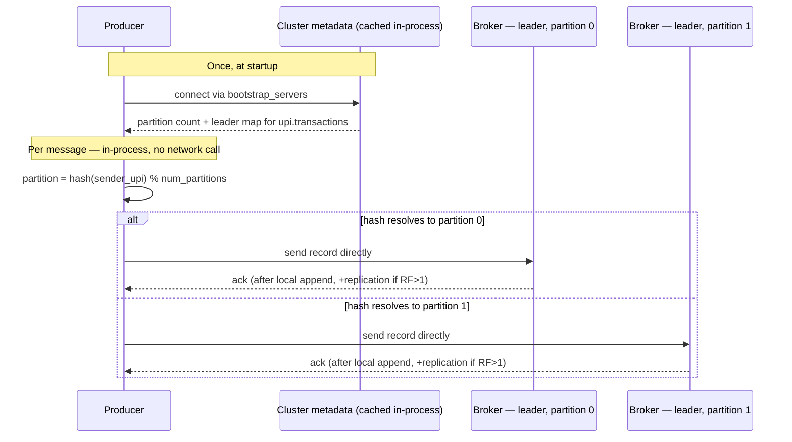
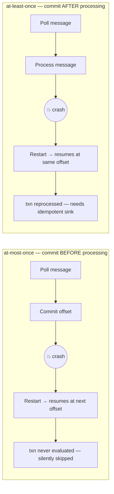

# Kafka Design Notes

Design decisions and reasoning for the Kafka layer of the UPI fraud detection pipeline.

---

## Topics

### Decision tree — when does something deserve its own topic?

- **Schema/shape of the event** — one topic should represent one well-defined "thing that happened," with one consistent message shape. A `upi.transactions` topic where every message means "a UPI transfer occurred" is a clean contract. If you later have a fundamentally different event (e.g. "a fraud alert was raised," "a user account was flagged") — different shape, different meaning — that's a signal for a new topic, not because of volume but because it's a different kind of fact.
- **Retention requirements** — retention (time/size-based deletion) is configured per topic, not per message. If raw transactions need 7 days but fraud alerts need to be kept for a year for compliance/audit, they can't share a topic — one config would be wrong for the other.
- **Consumer access boundaries** — if different teams/services should be allowed to read some data but not other data, ACLs are applied at the topic level. Splitting by who's allowed to see what is a real reason.
- **Compaction semantics** — Kafka topics can be `delete` (time/size-based, for event streams) or `compacted` (keep only the latest value per key, for current-state snapshots). These are incompatible configs on one topic — if you ever want a "latest known status per account" topic, that's compacted and structurally different from an event log.
- **Failure/backpressure isolation** — a slow or broken consumer on one topic shouldn't stall unrelated data. If two data types have very different processing reliability needs, isolating them limits blast radius.

### Selection examples

1. Only raw UPI fraud detection → 1 topic.
2. Need lower latency on high-value txns → split by txn amount, if the volume of low-value txns is higher and we're constrained on brokers.
3. Different use case/activity → different schema → definitely a new topic.
4. Product/demographic-based split → new topic is debatable, depends on the end use case.

**This project:** `upi_transactions`

---

## Number of Brokers

### Decision tree

- **Replication factor** — RF=3 will need 3 brokers for sure. Replication makes streaming fault-tolerant.
- **Throughput/storage ceiling of a broker node** — one broker can max out a node's resources (disk I/O, network, storage). More brokers = horizontal scaling for streaming.
- **Availability during maintenance** — more brokers let you patch/restart one at a time without an outage.

**This project:** single broker, so `KAFKA_OFFSETS_TOPIC_REPLICATION_FACTOR=1`.

---

## Number of Partitions

### Decision tree

1. **Ingest throughput** — how much total data/sec needs to land in the topic, divided by realistic per-partition throughput on your broker.
2. **Read-side parallelism you want** — how many parallel Spark tasks you want reading concurrently within a single job, since Kafka partitions cap that. This is about wanting N-way parallelism for performance, not about how many separate jobs/use-cases exist downstream.
3. **Key skew** — whether `sender_upi` values are evenly distributed enough that more partitions actually spreads load, rather than just adding empty buckets.
4. **Broker I/O ceiling** — single broker, so there's a real ceiling on how much parallel disk I/O is worth provisioning for, regardless of partition count.
5. **Resize cost** — repartitioning later reshuffles the key→partition mapping, breaking the sender-ordering guarantee for existing data, so better to size deliberately upfront.

### Worked example: sizing at LinkedIn scale

Real, published reference numbers:

| Metric | Value | Source |
|---|---|---|
| Messages/day | 7,000,000,000,000 (7 trillion) | LinkedIn public figure |
| Total partitions | 7,000,000 | LinkedIn public figure |
| Total brokers | 4,000 | LinkedIn public figure |
| Broker disk ceiling | 655 MB/s | real `i3en.2xlarge` benchmark (2× NVMe) |
| Partition ceiling | 4,000 partitions/broker | published ZK-based safe max |

#### Deriving partitions/broker and broker count from a target per-partition throughput

Given:
- `total_throughput = 81,000 MB/s` (≈ 7 trillion msgs/day × 1 KB avg ÷ 86,400s — from the LinkedIn-scale example above)
- `broker_disk_ceiling = 655 MB/s`
- `partition_ceiling = 4,000 partitions/broker`
- **Chosen constraint** (deliberately low, for latency + parallelism): `per_partition_throughput = 0.5 MB/s`

**Step 1 — exact max partitions/broker at this throughput target:**
```
max_partitions_per_broker = broker_disk_ceiling / per_partition_throughput
                           = 655 / 0.5
                           = 1,310 partitions/broker   # this is the ceiling, not a base to add overhead onto
```

**Step 2 — apply overhead/safety margin, stay below the ceiling:**
```
partitions_per_broker (chosen) = 1,200                 # ~92% of max, comfortable margin

check: 1,200 * 0.5 = 600 MB/s  <  655 MB/s ceiling        ✓
check: 1,200        <  4,000 partition_ceiling            ✓  (not the binding constraint here)
```

**Step 3 — broker count, from total throughput:**

Divide by the *realistic* per-broker throughput at the chosen partition count (`1,200 × 0.5 = 600 MB/s`), not the raw `broker_disk_ceiling` (655 MB/s) — a broker capped at 1,200 partitions never actually reaches 655, so dividing by 655 would undercount brokers.
```
broker_count = total_throughput / (partitions_per_broker * per_partition_throughput)
             = 81,000 / (1,200 * 0.5)
             = 81,000 / 600
             ≈ 135 brokers
```

**Step 4 — self-consistency check:**
```
total_partitions = broker_count * partitions_per_broker
                  = 135 * 1,200
                  = 162,000

# independent check — same number, derived without going through broker_count at all:
total_partitions = total_throughput / per_partition_throughput
                  = 81,000 / 0.5
                  = 162,000 partitions total   ✓ matches
```

> Total partition count only depends on `total_throughput` and `per_partition_throughput`; how you split it into brokers × partitions/broker doesn't change that total. The split only matters for checking against the two independent ceilings:
> 1. **Disk I/O:** `partitions_per_broker * per_partition_throughput ≤ broker_disk_ceiling` → `600 ≤ 655` ✓
> 2. **Failover time:** `partitions_per_broker ≤ ~4,000` (ZK-based) → `1,200 ≤ 4,000` ✓

---

## Producer vs. Consumer Rate

> Consumer rate should always be higher than producer rate. Otherwise data keeps accumulating and, in the long run, gets deleted once it ages past the retention policy — before it's ever consumed.

---

## Kafka Event Key — deciding which partition/broker an event goes to

The hashing happens on the producer, entirely before any broker is involved in that decision — brokers don't decide which partition a message goes to; they just store whatever the producer already decided.

The actual sequence:

1. **Metadata discovery** (once, at startup) — the producer connects to whatever's in `bootstrap_servers` (`kafka:29092` in the smoke test) just to ask "what does this cluster look like?" It gets back: how many partitions `upi.transactions` has, and which broker currently leads each partition. In a single-broker setup this map is trivial (1 broker leads everything), but in a real multi-broker cluster, different partitions are led by different brokers.

2. **Partition selection** (per message, client-side, in-process) — for a message keyed by `sender_upi`:
   ```
   partition = hash(sender_upi) % num_partitions
   ```
   Kafka's default partitioner uses a murmur2 hash of the key bytes, masked and modulo'd against the partition count. This computation happens entirely inside the producer's own process — no network call, no broker round-trip. It's just a function call against the cached metadata from step 1. (If there's no key, newer Kafka clients use a "sticky partitioner" — batch onto one partition for a while, then rotate — instead of hashing.)

3. **Direct send to the leader** — once the producer knows which partition, it looks up (in its cached metadata) which broker leads that partition, and sends the write directly to that broker — not to whichever broker happened to be the bootstrap contact, unless that also happens to be the leader. So with multiple brokers, a single producer instance is typically talking to several different brokers concurrently, one per partition-leader it's currently writing to.

4. **Broker just persists it** — the leader broker appends to its local log for that partition; if RF>1, followers replicate from the leader afterward, independent of the producer.



So `hash(sender_upi) → partition` is fixed and deterministic (same key always lands on the same partition, as long as partition count doesn't change — this is exactly the ordering guarantee from earlier), and `partition → broker` is just a lookup against cluster metadata the producer already cached. Both happen before the message physically leaves the producer's process — the broker's only role here is answering "what does the cluster look like" once upfront, then receiving writes it's told to store.

---

## Delivery Semantics

### Producer retries can duplicate a message

Example: `producer.send()` times out waiting for an ack, but the write actually succeeded on the broker. The client doesn't know that, retries, and the same transaction now exists twice on the topic.

**Fix:** `enable.idempotence=true` on the producer. Kafka tags each message with a sequence number per producer session; the broker recognizes and drops an exact retry instead of appending it twice.

### Consumer offset-commit timing decides the delivery guarantee

- **Commit offset BEFORE processing** → crash after commit, before processing runs → that message is silently skipped, never evaluated. (**at-most-once**)
- **Commit offset AFTER processing** → crash after processing, before commit → message gets reprocessed on restart. (**at-least-once** — requires idempotent handling downstream)



Example: a consumer evaluates `txn_id=abc123`, writes an alert to Postgres, then crashes before committing the offset. On restart it reprocesses `abc123` and would insert a second alert row for the same transaction, unless the sink is idempotent.

### Idempotent sink writes

Plain insert has no duplicate guard:
```sql
INSERT INTO fraud_alerts (txn_id, ...) VALUES (%s, ...)
```

A reprocessed `txn_id` creates a second row. Guarded version:
```sql
INSERT INTO fraud_alerts (txn_id, ...) VALUES (%s, ...)
ON CONFLICT (txn_id) DO NOTHING
```

(Requires a unique constraint on `txn_id`.) This is what makes at-least-once delivery behave like exactly-once from the business's point of view — Kafka/Spark alone can't guarantee that; the sink has to cooperate.

---

## Consumer Offset Tracking: Classic Consumer Group vs. Spark Structured Streaming

The plain `KafkaConsumer` model (partition assignment, one-partition-per-reader, offsets committed to Kafka's `__consumer_offsets` topic) is one mechanism. Spark Structured Streaming uses a different one — it does not rely on `__consumer_offsets` by default. It tracks progress itself via a **checkpoint location** (a directory storing offsets + aggregation state) and resumes from there on restart.

Example: `spark.readStream.format("kafka")....option("checkpointLocation", "/path/to/checkpoint")` — if that checkpoint directory is lost or wiped, Spark has no memory of what it already processed, regardless of what Kafka's own consumer-group offsets say.

---

## Schema Evolution

Plain JSON has no enforced contract between producer and consumer. Example: a new required field (e.g. `device_id`) gets added on the producer side without updating the consumer — old messages don't have it, new ones do, and any code assuming the field always exists breaks on old data (or vice versa if a field is removed). Standard prod answer is Avro + Schema Registry with a compatibility mode (backward/forward/full) enforced at write time.

---

## Compression

Producer-side compression (`compression.type=lz4` or `zstd`) shrinks both network and disk usage, usually at negligible CPU cost.

---

## Security

Auth (SASL) and encryption (TLS) protect a cluster in transit/at the connection layer. Local dev clusters are typically plaintext-only; real deployments need both configured.
